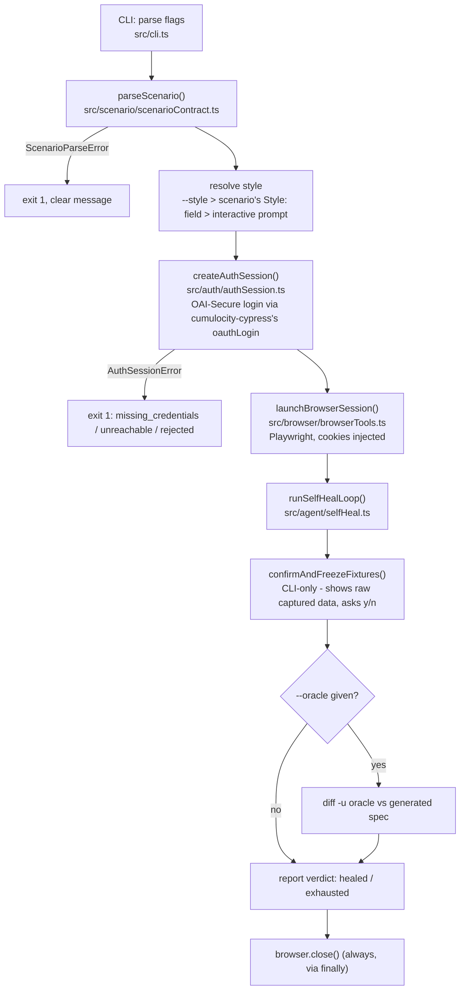
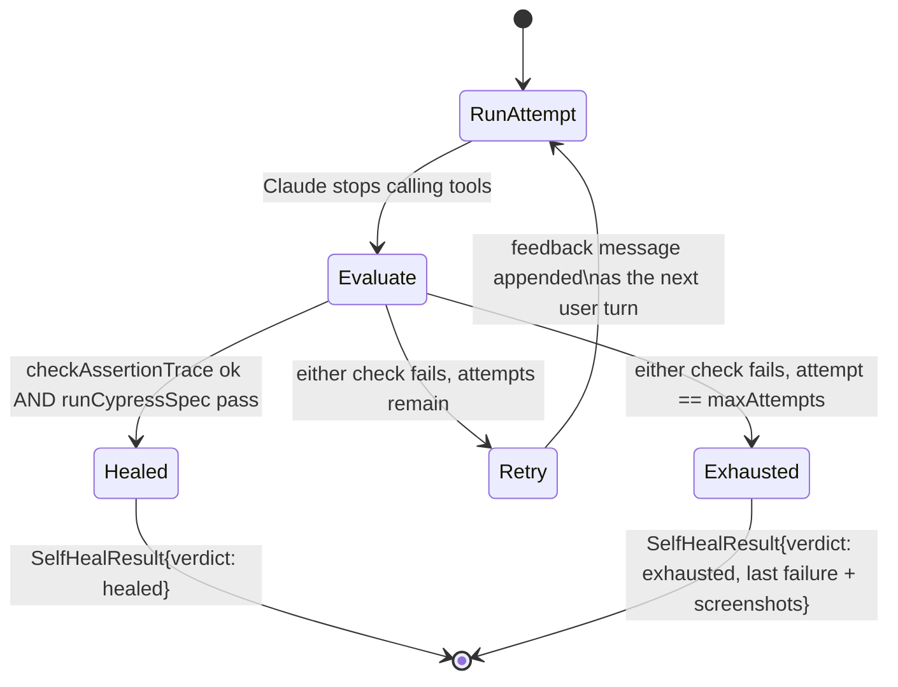
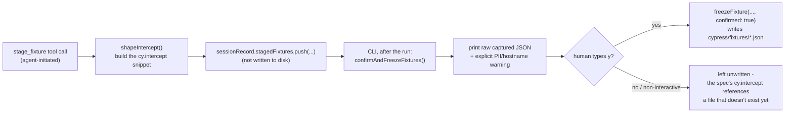
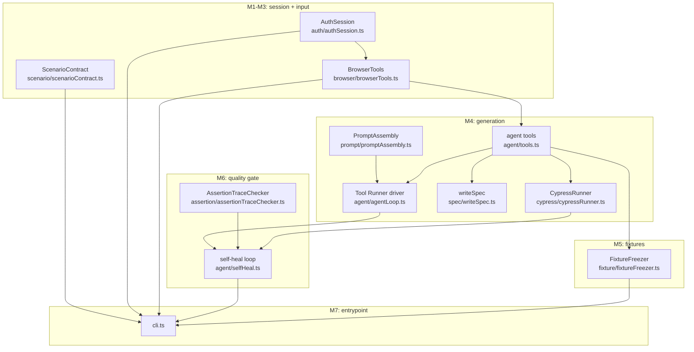

# c8y-cygen: How It Actually Works

This is a technical walkthrough of the implemented system (`packages/c8y-cygen`), for
anyone who wants to understand the mechanics rather than just the requirements. See
[PRD-c8y-cygen.md](./PRD-c8y-cygen.md) for the *why* and the product framing; this
document is the *how*, grounded in the actual modules built (M0–M7).

## The one-paragraph version

You write a `*.scenario.md` describing a user flow and its expected outcomes. The CLI
logs into a real Cumulocity tenant, opens a real browser against the real app, and
hands Claude a set of tools (navigate, inspect the DOM, click, type, capture network
traffic, write a spec file, run Cypress). Claude explores the live app like a person
would, writes a Cypress spec in the target repo's house style, and runs it. If it
fails — either Cypress itself fails, or an Expected Outcome isn't actually checked by
a real assertion — the failure is fed back and Claude tries again, up to a bounded
number of attempts. Anything captured from the network that would become a fixture
file is never written without a human explicitly reviewing it first.

## End-to-end pipeline



Everything left of `runSelfHealLoop` is one-time setup. Everything inside it is the
actual "agent explores and writes tests" loop, detailed below.

## Inside one self-heal attempt: the agentic loop

This is the part that's hardest to picture from the code alone, because the actual
control flow lives partly inside the Anthropic SDK's `BetaToolRunner` and partly in
`driveSelfHealLoop`. Concretely, for **one attempt**:

```mermaid
sequenceDiagram
    participant Loop as driveSelfHealLoop
    participant Runner as client.beta.messages.toolRunner(...)
    participant Claude
    participant Tool as an agent tool (e.g. browser_click)
    participant Browser as Playwright session

    Loop->>Runner: construct with {system, tools, messages}
    Note over Loop,Runner: messages = everything so far,<br/>including prior attempts' history
    loop while Claude keeps calling tools
        Runner->>Claude: messages.create(...)
        Claude-->>Runner: assistant turn (text + tool_use blocks)
        Runner->>Tool: tool.parse(input) [Zod validation]
        Tool->>Browser: navigate / snapshot / click / type / capture_network
        Browser-->>Tool: real DOM / network data - no hallucination
        Tool-->>Runner: tool_result
        Runner->>Runner: append tool_result as next user turn
    end
    Runner-->>Loop: final assistant message + full message history
```

Key mechanics worth naming explicitly:

- **`client.beta.messages.toolRunner(...)` only *constructs* the loop.** It's an async
  iterable that does nothing until iterated. `runToolRunnerToCompletion()`
  (`src/agent/agentLoop.ts`) is the function that actually drives it via `for await`,
  collecting each turn and returning the final one. This was a real bug caught during
  development — the first version returned the un-iterated runner and nothing ever ran.
- **Tool execution is fully mechanical, not agent-authored.** The 9 tools (`src/agent/
  tools.ts`) are thin wrappers: `browser_navigate/snapshot/click/type` and
  `capture_network` call straight into `BrowserTools` (Playwright); `write_spec` writes
  a file inside the target app repo with path-escape protection; `run_cypress` shells
  into *the target app's own installed Cypress*, never a bundled one, so generated
  specs get the app's real `cy.login`, custom commands, and config for free.
  `stage_fixture` is the odd one out — see the redaction section below.
- **The system prompt is assembled fresh every run**
  (`assembleSystemPrompt()`, `src/prompt/promptAssembly.ts`): the target app's own
  `e2e-tests.instructions.md` is *read live from disk*, never vendored into this repo,
  so it can never drift from what the app actually enforces. c8y-cygen's own
  `prompts/domain-notes.md` (Cumulocity-specific gotchas) is appended, plus a
  mocked/integration style branch.

## The bounded self-heal loop

One attempt ending doesn't mean the run is done. After each attempt, the CLI/loop
independently re-checks the result — it does **not** trust the agent's own
`run_cypress` tool call or its closing summary, since a plausible-sounding "done!" from
the model is exactly what this gate exists to catch.



The two independent checks, both real code you can read directly:

1. **`runCypressSpec()`** (`src/cypress/cypressRunner.ts`) — actually runs the spec
   headless via the target app's Cypress and parses pass/fail, per-test errors, and
   screenshot paths.
2. **`checkAssertionTrace()`** (`src/assertion/assertionTraceChecker.ts`) — the
   anti-gaming gate. Every Expected Outcome in the scenario must map to at least one
   `.should(...)` call in the generated spec, or it hard-fails **even if Cypress is
   green**. This stops the agent from reaching "success" by weakening or deleting an
   assertion.

`evaluateSelfHealAttempt()` (`src/agent/selfHeal.ts`) combines both into one verdict,
and `driveSelfHealLoop()` is the generic state machine above — it takes `runAttempt`/
`evaluateAttempt` as plain functions, which is what let this control flow (attempt
counting, message-history chaining, stop conditions) get unit-tested against fakes
with no live API calls at all.

### A real finding from building the assertion-trace checker

The heuristic (word-token overlap + literal quote/number matching, since there's no
LLM involved in the check itself) was validated against the actual frozen oracle at
`test/oracle/events.cy.oracle.ts` — real, currently-merged code from `cumulocity-ui-e2e`.
It correctly flags 3 of the oracle's 7 Expected Outcomes as **unmatched**, because
those specific checks use `.invoke('text').then(text => expect(...))` instead of
`.should(...)` — which is *also* what the target app's own house style says to avoid
("Use `.should()` for all assertions... Avoid `.then()` for assertions"). Rewriting
those three as `.should((el) => {...})` callbacks makes all 7 match. This wasn't a
contrived test — it's a genuine gap in already-merged code that the gate would force
a self-healing agent to fix, not paper over.

## Why fixture-writing is never something the agent can do



`freezeFixture()` (`src/fixture/fixtureFreezer.ts`) takes an explicit `confirmed: boolean`
and throws if it's `false`. The reason this is a *design* decision and not just an
implementation detail: if `confirmed` were exposed as a field on the `stage_fixture`
tool's input schema, the model could simply always pass `true`, and the whole
"human must review captured data before it's committed" guarantee (PRD "Fixture
safety") would be theater. So `freezeFixture` is called from exactly one place in the
entire codebase — inside `cli.ts`, after a human has seen the raw content on the
terminal and typed `y`. The agent has no path to it at all.

## Module map



## What's genuinely verified vs. what isn't yet

Every pure module (`ScenarioContract`, `CypressRunner`'s parser, `FixtureFreezer`,
`AssertionTraceChecker`, `evaluateSelfHealAttempt`, `driveSelfHealLoop`, `AuthSession`)
has real unit tests — 74 passing, several against **real captured artifacts**: actual
`cypress.run()` output, the actual frozen oracle file, actual Playwright accessibility
snapshots. The agent-facing wiring (`buildAgentTools`, `runGenerationLoop`,
`runSelfHealLoop`, `cli.ts`) is deliberately not unit-tested — it's thin glue around
the tested pieces, matching the PRD's own testing strategy — but was verified with
scratch scripts exercising real code paths (real file writes, real Zod validation,
real DNS-failure auth errors, real `diff` invocations), never just type-checked.

**The one thing not yet done:** an actual live run — real tenant, real
`ANTHROPIC_API_KEY` — confirming Claude reproduces or improves on the oracle end to
end. That's the MVP's real proof, and it needs credentials this environment doesn't
have.
